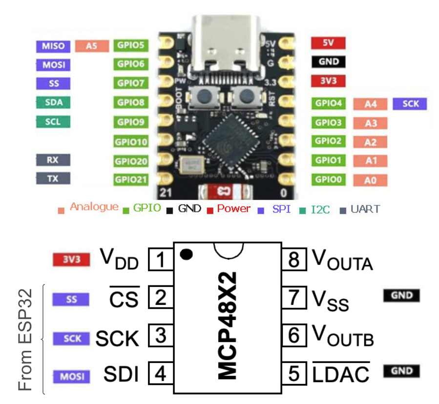
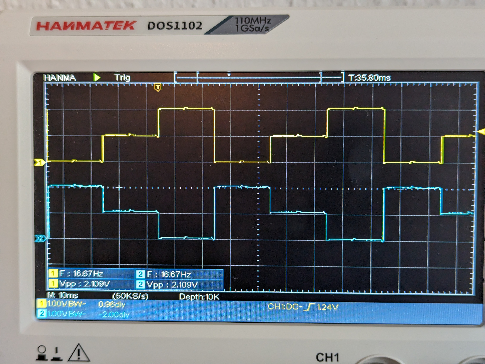

# ESP32-C3-SuperMini with 12-bit MCP4822 DAC

This sketch is a basic blueprint demonstrating how to connect the MCP4822 DAC to an ESP32-C3 Super Mini.

The code is not optimized for speed, but for portability. It should work on any Arduino or ESP32 with SPI pins.
For increased speed replace `digitalWrite(...)` with direct port manipulation to toggle the chip select low/high.

## Getting started

- Target device: ESP32-C3 Super Mini
- Board to set in Arduino IDE: ESP32 Dev Board
- [MCP4822 Datasheet](./docs/MCP4822-DAC-datasheet.pdf) TIP: See applicatoon notes and sample schematics at the end of the sheet. Very useful!

## Example output

Scope measuring VoutA and VoutB that are outputting the inverse of each other (this is what the code does).

There is quite a lot of interference because of breadboard and lack of decoupling capacitors.

